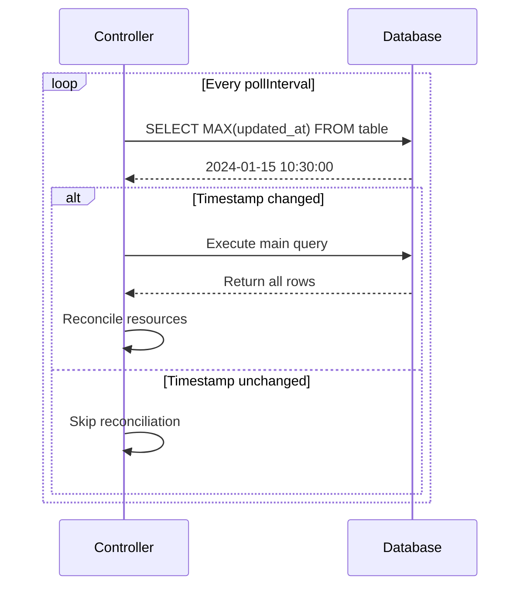
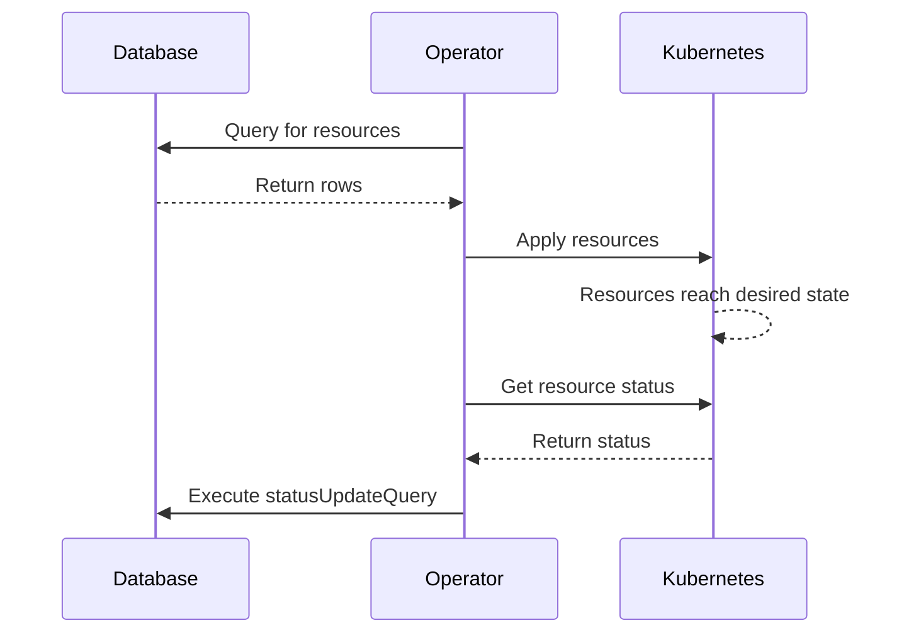

# Advanced Topics

This page covers advanced features and implementation details of the DB Query Operator.

## Change Detection

Change detection optimizes database polling by only executing the main query when data has actually changed.

### How It Works



### Implementation

The operator stores the last seen timestamp in memory and compares it on each poll:

1. **First Poll**: No timestamp cached, executes main query
2. **Subsequent Polls**: 
   - Queries `SELECT MAX(timestamp_column) FROM table_name`
   - Compares with cached value
   - Only runs main query if timestamp increased

### Configuration

```yaml
spec:
  changeDetection:
    enabled: true
    tableName: "my_table"
    timestampColumn: "updated_at"
```

### Database Requirements

Your table must have a timestamp column that updates whenever data changes:

```sql
CREATE TABLE my_table (
  id TEXT PRIMARY KEY,
  data JSONB,
  updated_at TIMESTAMP DEFAULT NOW()
);

-- Option 1: Trigger-based update
CREATE OR REPLACE FUNCTION update_timestamp()
RETURNS TRIGGER AS $$
BEGIN
  NEW.updated_at = NOW();
  RETURN NEW;
END;
$$ LANGUAGE plpgsql;

CREATE TRIGGER my_table_timestamp
BEFORE UPDATE ON my_table
FOR EACH ROW
EXECUTE FUNCTION update_timestamp();

-- Option 2: Application-managed
UPDATE my_table SET data = $1, updated_at = NOW() WHERE id = $2;
```

### Performance Impact

**Without change detection** (pollInterval = 30s):
- 120 queries/hour to database
- Full table scan every 30s
- Continuous resource reconciliation

**With change detection** (pollInterval = 30s):
- 120 lightweight timestamp checks/hour
- Main query only when data changes
- Reconciliation only when needed

**Example**: For a table updated 5 times/hour:
- Reduces main queries from 120 to 5 (96% reduction)
- Minimal overhead from timestamp checks

### Limitations

- Only detects row updates/inserts, not deletes (use `prune: true` for delete handling)
- Requires timestamp column maintained by triggers or application
- Single table only (no joins in change detection query)

### Best Practices

- Use change detection for tables with infrequent updates
- Set aggressive `pollInterval` (e.g., 30s) with change detection enabled
- Ensure timestamp column is indexed for performance
- Use database triggers for automatic timestamp updates

---

## Connection Pooling

The operator reuses database connections across reconciliation cycles.

### Implementation Details

- Single `*sql.DB` connection pool per `DatabaseQueryResource`
- Connection established on first reconciliation
- Reused for all subsequent polls
- Closed when `DatabaseQueryResource` is deleted

### Connection Configuration

Currently uses `pgx` defaults:
- Max open connections: Unlimited
- Max idle connections: 2
- Connection max lifetime: Unlimited
- Connection max idle time: Unlimited

### Future Enhancements

Connection pool configuration via CRD:

```yaml
# Future feature
spec:
  database:
    connectionPool:
      maxOpenConns: 10
      maxIdleConns: 5
      connMaxLifetime: "1h"
      connMaxIdleTime: "5m"
```

---

## Multi-Statement Query Execution

The operator automatically handles multi-statement queries using `pgx.Batch`.

### Detection Logic

```go
func splitStatements(sql string) []string {
    // Splits on semicolons outside of:
    // - Single quotes: 'text;text'
    // - Double quotes: "text;text"
    // - Dollar quotes: $$text;text$$
    // - Tagged dollar quotes: $tag$text;text$tag$
}
```

### Execution Strategy

When multiple statements detected:

1. Parse query into individual statements
2. Create `pgx.Batch`
3. Execute all but last statement (setup commands)
4. Execute last statement and return results

### Use Cases

#### Setting Session Parameters

```sql
SET statement_timeout = '5s';
SET lock_timeout = '3s';

SELECT * FROM large_table WHERE indexed_column = 'value';
```

The operator automatically:
1. Sets statement timeout
2. Sets lock timeout
3. Executes main query
4. Returns results from step 3

#### Using PostgreSQL Extensions

```sql
CREATE EXTENSION IF NOT EXISTS "uuid-ossp";
SET search_path = public, extensions;

SELECT uuid_generate_v4() as id, name FROM users;
```

Setup commands executed once, main query returns data.

### Limitations

- All statements except the last must not return data
- Cannot use transactions (each statement auto-commits)
- Error in setup statement aborts entire batch

---

## Resource Ownership and Finalizers

The operator uses Kubernetes ownership and finalizers for resource lifecycle management.

### Owner References

Every created resource has an owner reference pointing to its `DatabaseQueryResource`:

```yaml
apiVersion: v1
kind: ConfigMap
metadata:
  name: generated-config
  ownerReferences:
  - apiVersion: konnektr.io/v1alpha1
    kind: DatabaseQueryResource
    name: my-dbqr
    uid: abc-123
    controller: true
    blockOwnerDeletion: true
```

### Implications

- Deleting a `DatabaseQueryResource` automatically deletes managed resources
- Owner references work only for resources in the same namespace
- Cross-namespace or cluster-scoped resources require manual cleanup

### Finalizers

The operator adds a finalizer to track managed resources:

```yaml
apiVersion: konnektr.io/v1alpha1
kind: DatabaseQueryResource
metadata:
  name: my-dbqr
  finalizers:
  - konnektr.io/dbqr-finalizer
```

**Deletion Process**:
1. User deletes `DatabaseQueryResource`
2. Kubernetes marks resource for deletion (`deletionTimestamp` set)
3. Operator finalizer prevents immediate deletion
4. Operator cleans up managed resources
5. Operator removes finalizer
6. Kubernetes completes deletion

### Cross-Namespace Resources

For resources in different namespaces, the operator:
- Cannot set owner references (Kubernetes limitation)
- Tracks resources via labels/annotations
- Manually deletes on DBQR deletion via finalizer logic

### Cluster-Scoped Resources

Similar to cross-namespace resources:
- No owner references possible
- Manual tracking and cleanup
- Requires cluster-level RBAC permissions

---

## Server-Side Apply

The operator uses Kubernetes Server-Side Apply for resource management.

### Benefits

- **Conflict Resolution**: Multiple controllers can manage same resource
- **Field Ownership**: Operator owns only fields it sets
- **Partial Updates**: Only specified fields are updated
- **Drift Detection**: Kubernetes tracks who owns which fields

### Field Manager

The operator identifies itself as field manager:

```yaml
metadata:
  managedFields:
  - manager: db-query-operator
    operation: Apply
    apiVersion: v1
    fields:
      f:data:
        f:config.json: {}
```

### Implications

- Manual `kubectl edit` changes to managed fields are reverted
- Other controllers can manage non-conflicting fields
- Operator updates are atomic and conflict-free

### Example: Shared ConfigMap

```yaml
# Operator manages data section
apiVersion: v1
kind: ConfigMap
metadata:
  name: shared-config
  labels:
    managed-by: db-query-operator  # Operator field
    team: platform                # Manual field (preserved)
data:
  config.json: "{...}"           # Operator field
  manual-key: "manual-value"     # Manual field (preserved)
```

---

## Status Updates and Two-Way Sync

The `statusUpdateQuery` enables bidirectional synchronization between Kubernetes and the database.

### Architecture



### Use Cases

#### Track Deployment Readiness

```yaml
spec:
  statusUpdateQuery: |
    UPDATE deployments
    SET ready_replicas = {{ .Status.readyReplicas }},
        available_replicas = {{ .Status.availableReplicas }},
        last_check = NOW()
    WHERE name = {{ .Metadata.Name | squote }}
```

#### Track ArgoCD Application Sync Status

```yaml
spec:
  gvk:
    group: "argoproj.io"
    version: "v1alpha1"
    kind: "Application"
  
  statusUpdateQuery: |
    UPDATE applications
    SET sync_status = {{ .Status.sync.status | squote }},
        health_status = {{ .Status.health.status | squote }},
        last_synced = {{ .Status.operationState.finishedAt | squote }}
    WHERE app_name = {{ .Metadata.Name | squote }}
```

### Available Template Data

In `statusUpdateQuery`, you have access to:

- `.Metadata`: Resource metadata (name, namespace, labels, annotations)
- `.Status`: Complete resource status object
- `.Spec`: Resource spec (for reading values)

### Template Functions

- `squote`: Single-quote SQL strings safely
- `toJson`: Convert object to JSON string
- All Sprig functions

### Error Handling

- Status update failures are logged but don't block reconciliation
- Resource is still created/updated even if status update fails
- Useful for read-only database scenarios

---

## Performance Tuning

### Poll Interval Selection

**Aggressive (30s-1m)**:
- ✅ Use with change detection enabled
- ✅ Real-time requirements
- ❌ Without change detection (high DB load)

**Moderate (2m-5m)**:
- ✅ Most production workloads
- ✅ Balance between freshness and load
- ✅ Default recommendation

**Conservative (10m-1h)**:
- ✅ Infrequently changing data
- ✅ Large result sets
- ❌ Time-sensitive applications

### Query Optimization

```sql
-- Bad: Full table scan
SELECT * FROM resources;

-- Good: Indexed filter
SELECT * FROM resources WHERE enabled = true AND updated_at > NOW() - INTERVAL '24 hours';

-- Better: Materialized view
CREATE MATERIALIZED VIEW active_resources AS
  SELECT * FROM resources WHERE enabled = true;

CREATE INDEX ON active_resources(updated_at);

-- Query the view
SELECT * FROM active_resources;
```

### Resource Template Optimization

**Minimize Template Complexity**:
```yaml
# Complex (slower rendering)
resourceTemplate: |
  {{ range $i, $item := .Row.items | fromJson }}
  {{ if gt $item.value 100 }}
  ...
  {{ end }}
  {{ end }}

# Simple (faster rendering)
resourceTemplate: |
  data:
    items: {{ .Row.items }}
```

**Pre-compute in Database**:
```sql
-- Move logic to database
SELECT 
  name,
  CASE WHEN value > 100 THEN 'high' ELSE 'low' END as tier
FROM resources
```

---

## Security Considerations

### Database Credentials

- Store in Kubernetes Secrets
- Use namespace-local secrets when possible
- Rotate credentials regularly
- Use read-only database users where appropriate

### RBAC Permissions

The operator needs:

```yaml
# Same-namespace resources
- apiGroups: [""]
  resources: ["configmaps", "secrets"]
  verbs: ["get", "list", "create", "update", "patch", "delete"]

# Cross-namespace resources
- apiGroups: [""]
  resources: ["configmaps"]
  verbs: ["get", "list", "create", "update", "patch", "delete"]
  resourceNames: []  # Or specific names

# Cluster-scoped
- apiGroups: [""]
  resources: ["namespaces"]
  verbs: ["get", "list", "create", "update", "patch", "delete"]
```

### SQL Injection Prevention

The operator does NOT sanitize SQL queries. Ensure:

- Database users have minimal privileges
- Queries are written by trusted operators
- Use parameterized queries where possible (in `statusUpdateQuery` templates)

---

## Monitoring and Observability

### Logs

The operator logs:
- Reconciliation cycles
- Query execution times
- Resource creation/update/delete operations
- Errors and warnings

```bash
kubectl logs -n dbqo-system deployment/db-query-operator -f
```

### Metrics

**Future feature**: Prometheus metrics

```
dbqr_reconciliation_duration_seconds
dbqr_query_duration_seconds
dbqr_resources_managed_total
dbqr_errors_total
```

### Status Conditions

**Future feature**: Status conditions on DBQR

```yaml
status:
  conditions:
  - type: Ready
    status: "True"
    lastTransitionTime: "2024-01-15T10:00:00Z"
  - type: DatabaseConnected
    status: "True"
  observedGeneration: 5
  lastReconcile: "2024-01-15T10:30:00Z"
  managedResources: 15
```

---

## Next Steps

- Review [Examples](/docs/db-query-operator/examples) for practical implementations
- Check [Troubleshooting](/docs/db-query-operator/troubleshooting) for common issues
- See [API Reference](/docs/db-query-operator/api-reference) for complete CRD documentation
