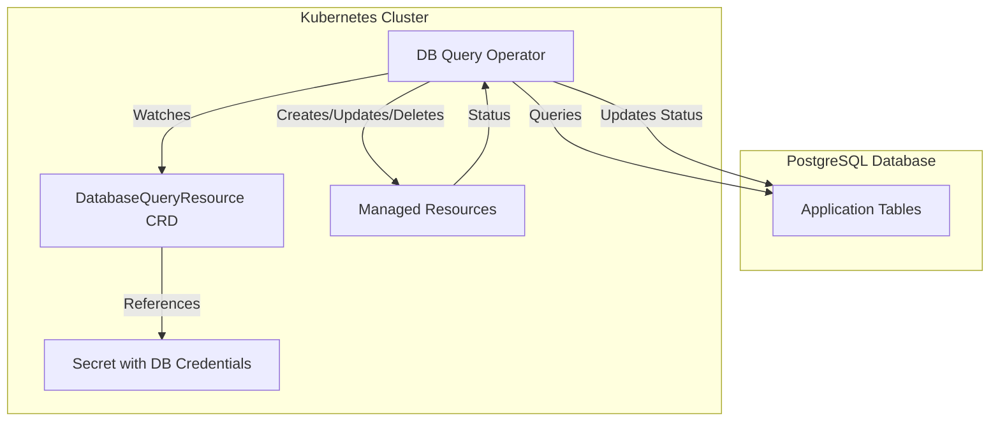

# Core Concepts

This page explains the fundamental concepts behind the DB Query Operator and how it manages Kubernetes resources based on database state.

## Architecture Overview



## DatabaseQueryResource (DBQR)

The `DatabaseQueryResource` is a Custom Resource Definition (CRD) that defines:

- **Database connection** details (via Secret reference)
- **SQL query** to execute
- **Go template** for rendering Kubernetes manifests
- **Reconciliation settings** (polling interval, pruning, change detection)

### Example Structure

```yaml
apiVersion: konnektr.io/v1alpha1
kind: DatabaseQueryResource
metadata:
  name: example
spec:
  pollInterval: "1m"              # How often to query
  prune: true                      # Remove stale resources
  database:
    type: postgres
    connectionSecretRef:
      name: db-credentials
  query: "SELECT * FROM resources;" # SQL query
  template: |                      # Go template for manifests
    apiVersion: v1
    kind: ConfigMap
    metadata:
      name: {{ .Row.name }}
    data:
      value: "{{ .Row.value }}"
```

## Reconciliation Loop

The operator runs a continuous reconciliation loop for each DatabaseQueryResource:

### 1. Query Phase

The operator:
- Connects to the database using credentials from the referenced Secret
- Executes the SQL query (supporting multi-statement queries)
- Retrieves all rows from the result set

### 2. Template Rendering Phase

For each row returned:
- The row data is made available as `.Row` in the template context
- The Go template is rendered using the [Sprig function library](http://masterminds.github.io/sprig/)
- The output is parsed as a Kubernetes manifest (YAML or JSON)

### 3. Resource Management Phase

For each rendered manifest:
- The operator checks if the resource already exists
- Compares the desired state with the last applied configuration
- Uses **Server-Side Apply** to create or update the resource
- Adds the `konnektr.io/managed-by` label for tracking

### 4. Pruning Phase (if enabled)

The operator:
- Lists all resources with the `konnektr.io/managed-by` label
- Identifies resources no longer in the current query results
- Deletes stale resources that were managed but no longer exist in the database

### 5. Status Update Phase

The operator updates the DatabaseQueryResource status with:
- Connection status
- Reconciliation success/failure
- List of managed resources
- Last poll time
- Any error messages

## Row-to-Resource Mapping

**One-to-One Relationship**: Each row in the query result typically generates one Kubernetes resource.

```sql
SELECT id, name, config FROM apps WHERE active = true;
-- Returns 3 rows → Creates 3 resources
```

```yaml
# Row 1: id=1, name='frontend', config='prod'
apiVersion: v1
kind: ConfigMap
metadata:
  name: frontend-config
---
# Row 2: id=2, name='backend', config='staging'
apiVersion: v1
kind: ConfigMap
metadata:
  name: backend-config
---
# Row 3: id=3, name='worker', config='dev'
apiVersion: v1
kind: ConfigMap
metadata:
  name: worker-config
```

## Go Template Context

Inside your template, you have access to:

### `.Row`

Contains all columns from the current database row:

```yaml
template: |
  # Access columns directly
  name: {{ .Row.app_name }}
  replicas: {{ .Row.replica_count }}
  
  # Use with functions
  name: {{ .Row.app_name | lower }}
  label: {{ .Row.app_name | replace "_" "-" }}
```

### `.Metadata`

Contains information about the parent DatabaseQueryResource:

```yaml
template: |
  # Get the DBQR's namespace
  namespace: {{ .Metadata.Namespace }}
  
  # Get the DBQR's name
  labels:
    managed-by: {{ .Metadata.Name }}
```

### Sprig Functions

All [Sprig template functions](http://masterminds.github.io/sprig/) are available:

```yaml
template: |
  # String functions
  name: {{ .Row.name | lower | replace " " "-" }}
  
  # Date functions
  created: {{ now | date "2006-01-02" }}
  
  # Encoding functions
  encoded: {{ .Row.data | b64enc }}
  
  # Conditional logic
  replicas: {{ if eq .Row.env "prod" }}3{{ else }}1{{ end }}
  
  # Default values
  timeout: {{ .Row.timeout | default "30s" }}
```

## Managed Resource Labels

All resources created by the operator receive a label:

```yaml
labels:
  konnektr.io/managed-by: <DatabaseQueryResource-name>
```

This label is used to:
- **Track ownership**: Identify which DBQR created the resource
- **Enable pruning**: Find resources to delete when rows are removed
- **Query resources**: Filter managed resources with `kubectl`

```bash
# List all resources managed by a specific DBQR
kubectl get all -l konnektr.io/managed-by=my-dbqr
```

## Resource Ownership

### Same Namespace Resources

When a managed resource is in the **same namespace** as the DatabaseQueryResource, the operator sets an **owner reference**:

```yaml
metadata:
  ownerReferences:
    - apiVersion: konnektr.io/v1alpha1
      kind: DatabaseQueryResource
      name: my-dbqr
      uid: <uid>
      controller: true
```

**Benefits**:
- **Automatic cascade deletion**: Kubernetes automatically deletes managed resources when the DBQR is deleted
- **Relationship visibility**: Tools like `kubectl tree` show the parent-child relationship

### Cross-Namespace or Cluster-Scoped Resources

When managing resources in **different namespaces** or **cluster-scoped resources** (like ClusterRoles, Namespaces), owner references **cannot be set** (Kubernetes limitation).

In these cases:
- Only the `konnektr.io/managed-by` label is used for tracking
- Manual cleanup is required if the DBQR is deleted (unless pruning + finalizer is used)

## Server-Side Apply

The operator uses [Server-Side Apply (SSA)](https://kubernetes.io/docs/reference/using-api/server-side-apply/) to manage resources:

### Benefits

- **Field-level conflict resolution**: Multiple controllers can manage different fields of the same resource
- **Declarative updates**: Only specified fields are updated, others are preserved
- **Field ownership tracking**: Kubernetes tracks which controller owns which fields

### Implications

- The operator becomes the **field manager** for all fields in the template
- Other controllers can still manage fields not in your template
- Updates are atomic and efficient

### Change Detection

The operator stores the last applied configuration in an annotation:

```yaml
annotations:
  konnektr.io/last-applied-configuration: '<json>'
```

Before applying a resource, the operator:
1. Fetches the current resource from the cluster
2. Retrieves the last applied configuration
3. Compares current desired state with last applied
4. Only applies if there are differences

This **reduces unnecessary API calls** and **prevents update storms**.

## Pruning Behavior

When `prune: true` (default):

1. **After each reconciliation**, the operator compares:
   - Resources currently in query results
   - Resources with the `konnektr.io/managed-by` label

2. **Stale resources** (labeled but not in results) are **deleted**

3. **Pruning is scoped** to the GVKs (GroupVersionKinds) the operator is configured to watch

### Example

```sql
-- Initial state: 3 rows
SELECT id FROM apps; -- Returns: 1, 2, 3
-- Creates: app-1, app-2, app-3

-- Row deleted
DELETE FROM apps WHERE id = 2;
SELECT id FROM apps; -- Returns: 1, 3
-- Deletes: app-2
-- Keeps: app-1, app-3
```

### Disabling Pruning

```yaml
spec:
  prune: false  # Resources are never deleted, only created/updated
```

Use this when:
- You want manual control over resource deletion
- Resources should persist even after database rows are removed
- You have external processes managing resource lifecycle

## Finalizers

To ensure managed resources are deleted when the DatabaseQueryResource is deleted, add a finalizer:

```yaml
metadata:
  finalizers:
    - konnektr.io/databasequeryresource-finalizer
```

With a finalizer:
1. When the DBQR is deleted, Kubernetes marks it for deletion but doesn't remove it yet
2. The operator detects the deletion timestamp
3. The operator deletes all managed resources
4. Once complete, the operator removes the finalizer
5. Kubernetes completes the DBQR deletion

**Without a finalizer**: Deleting the DBQR leaves managed resources in place (unless they have owner references).

## Polling vs Change Detection

### Standard Polling

```yaml
spec:
  pollInterval: "5m"  # Query every 5 minutes
```

- Simple and reliable
- Works with any database schema
- Higher latency (up to `pollInterval`)
- More database load

### Change Detection (Optional)

```yaml
spec:
  pollInterval: "5m"          # Safety net
  changeDetection:
    enabled: true
    tableName: "apps"
    timestampColumn: "updated_at"
    changePollInterval: "10s" # Check for changes every 10s
```

- Lightweight change queries every 10 seconds
- Full reconciliation only when changes detected
- Lower latency (~10 seconds)
- Reduced database load
- Requires `updated_at` timestamp column

See [Advanced Topics](/docs/db-query-operator/advanced#change-detection) for implementation details.

## Multi-Statement Query Support

The operator automatically handles multi-statement queries using **pgx batch operations**:

```yaml
query: |
  LOAD '$libdir/plugins/age';
  SET search_path = ag_catalog, "$user", public;
  SELECT * FROM cypher('graph', $$
    MATCH (n:Node) RETURN n.id AS id, n.name AS name
  $$) AS (id text, name text);
```

**How it works**:
1. The operator splits the query on semicolons (respecting quotes and dollar-quotes)
2. All statements except the last are executed as a batch
3. The final statement (the SELECT) is executed and results are returned
4. This enables setup commands like `LOAD` and `SET` for Apache AGE

## Next Steps

<Cards>
  <Card title="Configuration Reference" href="/docs/db-query-operator/configuration">
    Detailed explanation of all CRD fields and options
  </Card>
  
  <Card title="Examples" href="/docs/db-query-operator/examples">
    Real-world examples of DatabaseQueryResources
  </Card>
  
  <Card title="Advanced Topics" href="/docs/db-query-operator/advanced">
    Change detection, status updates, and cross-namespace management
  </Card>
</Cards>
