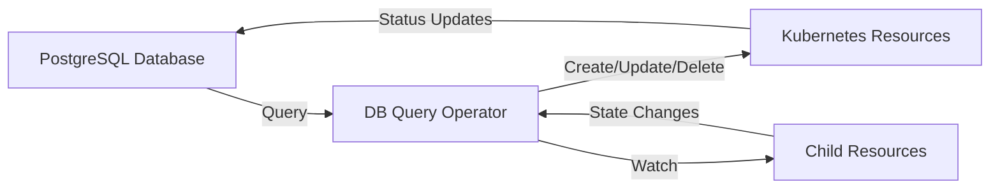

The **Database Query Operator** is a Kubernetes operator that bridges your database state with your Kubernetes cluster. It periodically queries a PostgreSQL database, executes user-defined SQL queries, and dynamically creates, updates, or deletes Kubernetes resources based on the results.

## Why Use the DB Query Operator?

<Cards>
  <Card title="Database-Driven Infrastructure" icon="database">
    Manage your Kubernetes resources directly from your application's database state. No need for separate configuration files or manual updates.
  </Card>
  
  <Card title="Dynamic Resource Management" icon="refresh-cw">
    Automatically create, update, and prune resources as your database state changes. Perfect for multi-tenant environments and dynamic workloads.
  </Card>
  
  <Card title="Multi-Statement Queries" icon="layers">
    Support for multi-statement SQL queries, enabling setup commands and complex query patterns.
  </Card>
  
  <Card title="Change Detection" icon="zap">
    Efficient polling with optional change detection reduces database load while maintaining quick response times to state changes.
  </Card>
</Cards>

## Key Features

- **PostgreSQL Support**: Query relational data with standard SQL or multi-statement queries
- **Go Templating**: Use powerful Go templates with Sprig functions to generate any Kubernetes manifest
- **Multi-Statement Queries**: Execute setup commands (LOAD, SET) alongside your data queries
- **CloudNativePG Integration**: Native support for CNPG-managed databases with URI-based connections
- **Change Detection**: Optional lightweight polling for sub-second response to database changes
- **Automatic Pruning**: Clean up resources that no longer exist in query results
- **Cross-Namespace Resources**: Manage resources across namespaces and cluster-scoped resources
- **Status Synchronization**: Optionally write Kubernetes resource status back to your database

## Quick Start

Install the operator via Helm:

```bash
helm install db-query-operator \
  oci://ghcr.io/konnektr-io/charts/db-query-operator \
  --namespace dbqo-system \
  --create-namespace
```

Create your first DatabaseQueryResource:

```yaml
apiVersion: konnektr.io/v1alpha1
kind: DatabaseQueryResource
metadata:
  name: my-first-dbqr
spec:
  pollInterval: "1m"
  database:
    type: postgres
    connectionSecretRef:
      name: db-credentials
  query: "SELECT id, name FROM resources WHERE active = true;"
  template: |
    apiVersion: v1
    kind: ConfigMap
    metadata:
      name: resource-{{ .Row.id }}
    data:
      name: "{{ .Row.name }}"
```

## Use Cases

### Multi-Tenant Environments
Automatically provision tenant-specific resources (namespaces, databases, applications) based on tenant records in your database.

### Digital Twin Management
Use graph queries to discover relationships between digital twins and create corresponding Kubernetes resources for IoT workloads, monitoring, or data processing.

### Dynamic Application Deployment
Deploy ArgoCD Applications, Helm releases, or other resources based on environment configurations stored in your database.

### Infrastructure as Data
Treat your database as the source of truth for infrastructure configuration, enabling programmatic resource management through standard database operations.

## Architecture



The operator runs as a Kubernetes Deployment and:
1. Periodically queries your database
2. Renders Kubernetes manifests using Go templates
3. Applies resources to the cluster using Server-Side Apply
4. Optionally prunes resources no longer in query results
5. Updates database with resource status

## Next Steps

<Cards>
  <Card title="Getting Started" href="/docs/db-query-operator/getting-started">
    Install the operator and create your first DatabaseQueryResource
  </Card>
  
  <Card title="Core Concepts" href="/docs/db-query-operator/core-concepts">
    Understand how the operator works and key concepts
  </Card>
  
  <Card title="Examples" href="/docs/db-query-operator/examples">
    Explore real-world examples and common patterns
  </Card>
  
  <Card title="Configuration" href="/docs/db-query-operator/configuration">
    Learn about all configuration options and fields
  </Card>
</Cards>

## Community & Support

- **GitHub**: [konnektr-io/db-query-operator](https://github.com/konnektr-io/db-query-operator)
- **Issues**: Report bugs or request features on GitHub
- **License**: Apache 2.0
